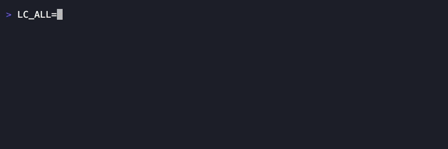

<div align="center">

# LimitDeck

**Know what you have left—before the limit hits.**

A compact, privacy-safe terminal dashboard for AI coding subscription limits and local per-model usage.

[](https://github.com/rockythink/limitdeck/releases/latest)
[](https://crates.io/crates/limitdeck)
[](https://github.com/rockythink/limitdeck/actions/workflows/ci.yml)
[](LICENSE)

[English](README.md) · [简体中文](README.zh-CN.md)

</div>

<p align="center">
  <code>brew install rockythink/tap/limitdeck</code>
</p>

<p align="center">
  
</p>

---

## One dashboard. Only the limits that matter.

<table>
<tr>
<td width="33%" valign="top">
<strong>Private by design</strong><br><br>
Uses local interfaces and stores only aggregate quota and usage metadata. No copied credentials, browser cookies, subscription-page scraping, or Codex <code>auth.json</code> access.
</td>
<td width="33%" valign="top">
<strong>Signal over noise</strong><br><br>
See remaining percentages, reset times, per-model tokens and cost, and local quota history without opening several apps or account pages.
</td>
<td width="33%" valign="top">
<strong>Made for the terminal</strong><br><br>
Fast keyboard control, compact narrow layouts, three runtime themes, and prebuilt binaries for macOS and Linux.
</td>
</tr>
</table>

## Install

### Homebrew — recommended on macOS

```bash
brew install rockythink/tap/limitdeck
```

### Cargo

Requires Rust 1.88 or newer.

```bash
cargo install limitdeck
```

### Prebuilt binaries

Download a macOS or Linux archive and `SHA256SUMS` from the [latest GitHub Release](https://github.com/rockythink/limitdeck/releases/latest).

Then start the dashboard from any terminal:

```bash
limitdeck
```

LimitDeck automatically discovers an installed and authenticated Codex CLI. There is no separate LimitDeck login.

## Data sources

| Plan | Local source | Support |
| --- | --- | :---: |
| Codex | Official Codex App Server, `account/rateLimits/read` | Built in |
| Claude | Official Claude Code status-line JSON | Built in |
| Codex fallback | OMP redacted usage output | Optional |

The Codex App Server is preferred whenever both it and the OMP fallback are available.

```text
official local protocol ─┐
quota-only snapshot ─────┼─> normalized usage windows ─> LimitDeck
optional redacted output ┘
```

## Local model usage

Press <kbd>m</kbd> or <kbd>Tab</kbd> to switch between subscription quotas and model usage. Model usage is grouped by the agent that made the request, provider, and exact model ID. These counters describe local agent activity; they are not provider account totals and cannot be converted into subscription quota percentages.

The line below the tabs shows the selected model's statistics period: its earliest and latest locally observed usage. Each source reports all usage still present in its local records, so older agents can remain visible even when they were not used during the selected model's period.

Model usage defaults to the last 30 days. Press <kbd>f</kbd> to cycle through **24h**, **7d**, **30d**, and **All**. The status line reports active models and how many older models are hidden. Filtering changes only the view; it never deletes local records.

| Agent | Source | Coverage |
| --- | --- | --- |
| OMP | `omp stats --json` | Requests, tokens, cache, errors, cost, and timing |
| Codex | Metadata-only fields from local rollout records | Requests and token kinds; no cost |
| Claude Code | Model, context, and cost fields received by `limitdeck ingest claude` | Usage observed after status-line setup |
| Gemini CLI | Metadata-only fields from local session records | Requests and token kinds; no cost |
| OpenCode | Usage columns queried from its local SQLite database | Requests, tokens, cache, errors, and cost; requires `sqlite3` |
| Pi | Metadata-only fields from `~/.pi/agent/sessions` | Requests, tokens, cache, errors, cost, and timing |
| Aider | Aider's optional analytics JSONL log | Requests, tokens, and cost after setup |

For Aider, enable its local analytics log:

```yaml
# ~/.aider.conf.yml
analytics-log: ~/.cache/limitdeck/aider.jsonl
```

Set `AIDER_ANALYTICS_LOG` when using a different path. LimitDeck never reads Aider's LLM or chat history files.

## Claude Code setup

Claude Code exposes subscription rate limits through its official status-line input. Add this to `~/.claude/settings.json`:

```json
{
  "statusLine": {
    "type": "command",
    "command": "limitdeck ingest claude",
    "refreshInterval": 60
  }
}
```

The command writes two files in `$XDG_CACHE_HOME/limitdeck`, or `~/.cache/limitdeck` when `XDG_CACHE_HOME` is unset:

- `claude.json` for quota windows; and
- `claude-models.json` for aggregate per-model usage.

Claude Code provides `rate_limits` only for eligible subscriptions and only after the first API response in a session.

> This setting replaces an existing custom Claude Code status line. If you already use one, call `limitdeck ingest claude` from that script and pass the original JSON through stdin.

## The interface

### Languages

LimitDeck reads the first non-empty value from `LC_ALL`, `LC_MESSAGES`, and `LANG` at startup. Chinese locales open in Chinese; every other locale opens in English. Press <kbd>l</kbd> to switch languages immediately for the current session.


### Quota and time

Every reset window places two remaining percentages on vertically aligned rows using the same 100-to-0 scale:

- **Q / Quota** — quota remaining.
- **T / Time** — time remaining until reset, divided by the window's full duration.

The list and detail views place quota above time so their bars share the same starting point and are directly comparable. LimitDeck does not classify usage or recommend what to do.

### Secondary limits

GPT-5.3-Codex-Spark windows are treated as secondary limits and hidden by default. When they are available, a neutral status row reports how many are hidden. Press <kbd>s</kbd> to show or hide them in both the list and detail views. This is a session-only display choice; data collection and local history are unchanged.

### Themes

Press <kbd>t</kbd> to cycle through:

| Theme | Character |
| --- | --- |
| **Rainbow** | Default. Deep background with green, violet, pink, orange, and blue accents inspired by OMP |
| **Midnight** | Restrained, cool-toned dark palette |
| **Mono** | High-contrast grayscale |

Theme changes apply immediately and are restored the next time LimitDeck starts. LimitDeck respects the [`NO_COLOR`](https://no-color.org/) convention; unset it to display theme colors.

### Controls

| Key | Action |
| --- | --- |
| <kbd>↑</kbd> / <kbd>↓</kbd>, <kbd>k</kbd> / <kbd>j</kbd> | Select a plan |
| <kbd>Enter</kbd> | Open or close plan details |
| <kbd>Esc</kbd> | Return to the list, then exit |
| <kbd>r</kbd> | Refresh sources |
| <kbd>m</kbd> / <kbd>Tab</kbd> | Switch between quotas and model usage |
| <kbd>f</kbd> | Cycle the model usage range through 24h, 7d, 30d, and All |
| <kbd>s</kbd> | Show or hide secondary limits |
| <kbd>t</kbd> | Cycle themes |
| <kbd>l</kbd> | Switch between English and Chinese |
| <kbd>?</kbd> | Open or close the contextual keyboard help |
| <kbd>q</kbd> | Exit |

Narrow terminals retain the vertical quota/time comparison in a compact form. The model view follows the current selection: widths below 64 columns use a focused metric card, widths from 64 to 95 columns combine selected-model metrics with a scroll-following summary, and wider terminals show the full table. Footer labels also shorten before they would clip.

Theme, language, model time range, and secondary-limit visibility are stored at `$XDG_CONFIG_HOME/limitdeck/config.json`, or `~/.config/limitdeck/config.json` when `XDG_CONFIG_HOME` is unset. Invalid or unsupported preference files are ignored and replaced by safe defaults on the next preference change.

### Local quota history

Open a plan to see locally sampled history when the terminal has enough rows.

- A changing current-cycle history with at least three samples becomes a compact Braille trend line.
- The trend includes its real time span, start and end values, and delta.
- Flat or sparse history remains textual rather than drawing a misleading chart.
- A quota increase starts a new visual cycle.

History is stored at `$XDG_CACHE_HOME/limitdeck/history.json`, or `~/.cache/limitdeck/history.json` when `XDG_CACHE_HOME` is unset. LimitDeck retains at most 30 days and 2,048 samples per quota window. After the first two real samples, unchanged values are sampled no more than once every 15 minutes.

## Privacy, by design

LimitDeck retains the minimum state needed to draw the dashboard.

| Retained locally | Deliberately ignored |
| --- | --- |
| Provider, plan, and quota-window identifiers | Account email and account ID |
| Agent, provider, model ID, and aggregate token counters | Prompts, responses, tool output, and reasoning content |
| Remaining percentages, reset times, and usage timestamps | Organization and plan tier |
| Locally reported model cost | Provider billing statements |
| History timestamps, availability state, and interface preferences | Raw credentials and provider responses |

Parser inputs and subprocess output are size-bounded. Child processes have explicit timeouts and are reaped on exit.

Diagnostics keep only a fixed source label and a safe failure category. Raw stderr, provider payloads, credentials, account fields, email addresses, and local paths are never retained in application state.

## When a source cannot refresh

A failing source stays visible. If a previous snapshot exists, LimitDeck marks it as cached; otherwise the row shows `Unavailable · Enter for details`.

| Reason | Next action |
| --- | --- |
| Source command missing | Install the named CLI, confirm it is on `PATH`, then press <kbd>r</kbd> |
| Not authenticated | Log in to the named source, then press <kbd>r</kbd> |
| Timed out | Check the network and retry with <kbd>r</kbd> |
| Provider protocol changed | Upgrade LimitDeck; open an issue if the failure remains |
| Claude snapshot missing | Configure `limitdeck ingest claude` as the Claude Code status line |
| Cached snapshot expired | Refresh the source with <kbd>r</kbd> |

## Architecture

The core stays intentionally small:

```text
official protocols / safe snapshots / metadata-only local records
                              │
             PlanAdapter + ModelUsageAdapter
                    │                  │
       CodingPlan → UsageWindow    ModelUsage
                    └─────────┬────────┘
                       App state → TUI
```

Adapters own provider-specific parsing and timeouts. The domain and UI do not depend on Codex, Claude, or OMP response formats.

## Development

```bash
cargo fmt --check
cargo test --locked --all-targets --all-features
cargo clippy --locked --all-targets --all-features -- -D warnings
cargo build --release --locked
```

## Project notes

LimitDeck is an independent open-source project and is not affiliated with or endorsed by OpenAI, Anthropic, or OMP. Provider interfaces and subscription limits may change.

Released under the [MIT License](LICENSE).
