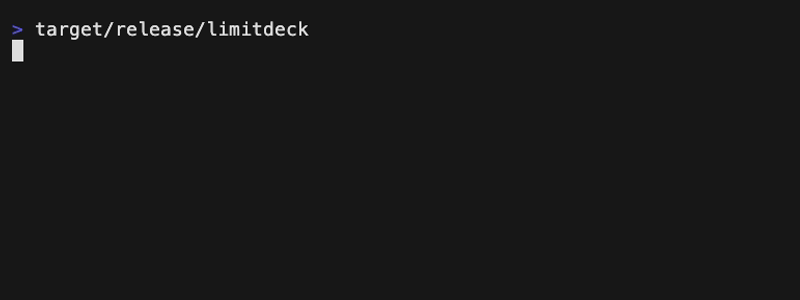

<div align="center">

# LimitDeck

**在额度撞线之前，先知道还剩多少。**

一个紧凑、隐私安全的 AI 编程订阅额度终端仪表盘。

[](https://github.com/rockythink/limitdeck/releases/latest)
[](https://crates.io/crates/limitdeck)
[](https://github.com/rockythink/limitdeck/actions/workflows/ci.yml)
[](LICENSE)

[English](README.md) · [简体中文](README.zh-CN.md)

</div>

<p align="center">
  <code>brew install rockythink/tap/limitdeck</code>
</p>

<p align="center">
  
</p>

---

## 一个界面，只看真正重要的额度信息

<table>
<tr>
<td width="33%" valign="top">
<strong>隐私是设计前提</strong><br><br>
只使用官方本地接口，只保存额度快照。不复制凭据、不读取浏览器 Cookie、不抓取订阅网页，也不读取 Codex <code>auth.json</code>。
</td>
<td width="33%" valign="top">
<strong>只留下有效信号</strong><br><br>
在一个界面里查看剩余百分比、重置时间、缓存状态和本地额度历史，不必来回打开多个应用或账户页面。
</td>
<td width="33%" valign="top">
<strong>为终端而生</strong><br><br>
全键盘操作、窄终端紧凑布局、三套运行时主题，并提供 macOS 与 Linux 预编译包。
</td>
</tr>
</table>

## 安装

### Homebrew — macOS 推荐

```bash
brew install rockythink/tap/limitdeck
```

### Cargo

需要 Rust 1.88 或更高版本。

```bash
cargo install limitdeck
```

### 预编译包

从[最新 GitHub Release](https://github.com/rockythink/limitdeck/releases/latest)下载 macOS 或 Linux 压缩包以及 `SHA256SUMS`。

安装后，在任意终端启动：

```bash
limitdeck
```

LimitDeck 会自动发现已经安装并登录的 Codex CLI，不需要额外登录 LimitDeck。

## 数据来源

| 订阅 | 本地来源 | 支持状态 |
| --- | --- | :---: |
| Codex | 官方 Codex App Server，`account/rateLimits/read` | 内置 |
| Claude | 官方 Claude Code status-line JSON | 内置 |
| Codex 备用来源 | OMP 脱敏用量输出 | 可选 |

Codex App Server 与 OMP 备用来源同时可用时，LimitDeck 优先使用 App Server。

```text
官方本地协议 ─┐
纯额度快照 ───┼─> 标准化额度窗口 ─> LimitDeck
可选脱敏输出 ─┘
```

## Claude Code 配置

Claude Code 通过官方 status-line 输入提供订阅限额。将以下配置加入 `~/.claude/settings.json`：

```json
{
  "statusLine": {
    "type": "command",
    "command": "limitdeck ingest claude",
    "refreshInterval": 60
  }
}
```

该命令只写入额度快照，位置为：

- `$XDG_CACHE_HOME/limitdeck/claude.json`；或
- 未设置 `XDG_CACHE_HOME` 时的 `~/.cache/limitdeck/claude.json`。

只有符合条件的订阅才会收到 Claude Code 的 `rate_limits`，而且当前会话完成第一次 API 响应后才会出现。

> 这项配置会替换现有的 Claude Code 自定义状态栏。若你已经使用状态栏脚本，请在原脚本中调用 `limitdeck ingest claude`，并通过 stdin 传入原始 JSON。

## 界面

### 主题

按 <kbd>t</kbd> 循环切换：

| 主题 | 风格 |
| --- | --- |
| **Rainbow** | 默认主题。深色背景搭配绿色、紫色、粉色、橙色和蓝色强调，灵感来自 OMP |
| **Midnight** | 克制、偏冷的深色主题 |
| **Mono** | 高对比黑白灰主题 |

主题会立即应用于当前会话的列表页和详情页。LimitDeck 遵循 [`NO_COLOR`](https://no-color.org/) 约定；如需显示主题颜色，请取消该环境变量。

### 快捷键

| 按键 | 操作 |
| --- | --- |
| <kbd>↑</kbd> / <kbd>↓</kbd>、<kbd>k</kbd> / <kbd>j</kbd> | 选择订阅 |
| <kbd>Enter</kbd> | 打开或关闭订阅详情 |
| <kbd>Esc</kbd> | 返回列表，再按一次退出 |
| <kbd>r</kbd> | 刷新数据来源 |
| <kbd>t</kbd> | 切换主题 |
| <kbd>q</kbd> | 退出 |

窄终端会自动收缩为紧凑百分比布局；列表超过视口高度时，当前选择项始终保持可见。

### 本地额度历史

终端高度足够时，打开订阅详情即可查看本地采样历史。

- 当前周期存在至少三个变化样本时，显示紧凑的 Braille 趋势线。
- 趋势同时标明真实时间跨度、起始值、结束值和变化量。
- 历史持平或样本稀疏时继续使用文字，避免画出误导性图形。
- 额度上升时开始新的视觉周期。

历史保存在 `$XDG_CACHE_HOME/limitdeck/history.json`；未设置 `XDG_CACHE_HOME` 时使用 `~/.cache/limitdeck/history.json`。每个额度窗口最多保留 30 天、2,048 个样本。取得最初两个真实样本后，数值未变化时最多每 15 分钟采样一次。

## 隐私是设计前提

LimitDeck 只保留绘制仪表盘所必需的最小状态。

| 本地保留 | 明确忽略 |
| --- | --- |
| 提供方、订阅和额度窗口标识 | 账户邮箱与账户 ID |
| 展示标签与窗口时长 | 组织与订阅等级 |
| 剩余百分比与重置时间 | 账单数据 |
| 历史时间戳与可用状态 | 原始凭据与提供方响应 |

解析器输入与子进程输出都有大小上限。子进程有明确超时，并会在退出时回收。

诊断信息只保留固定的数据来源标签和安全的失败类别。原始 stderr、提供方载荷、凭据、账户字段、邮箱地址和本地路径都不会保存在应用状态中。

## 数据来源无法刷新时

失败的数据来源不会从界面消失。存在旧快照时会标记为缓存；没有快照时则显示 `不可用 · Enter 查看原因`。

| 原因 | 下一步 |
| --- | --- |
| 未找到来源命令 | 安装对应 CLI，确认它位于 `PATH`，再按 <kbd>r</kbd> |
| 来源尚未登录 | 登录对应数据来源，再按 <kbd>r</kbd> |
| 来源响应超时 | 检查网络，再按 <kbd>r</kbd> 重试 |
| 提供方协议变化 | 升级 LimitDeck；问题仍存在时提交 Issue |
| Claude 快照缺失 | 将 `limitdeck ingest claude` 配置为 Claude Code 状态栏 |
| 缓存快照过期 | 刷新数据来源后再按 <kbd>r</kbd> |

## 架构

核心刻意保持简单：

```text
官方协议 / 安全快照 / 可选备用来源
                    │
               PlanAdapter
                    │
      CodingPlan ─> UsageWindow
                    │
        应用状态 + 本地历史 ─> TUI
```

适配器负责各提供方的解析和超时策略；领域层和 UI 不依赖 Codex、Claude 或 OMP 的响应格式。

## 开发

```bash
cargo fmt --check
cargo test --locked --all-targets --all-features
cargo clippy --locked --all-targets --all-features -- -D warnings
cargo build --release --locked
```

## 项目说明

LimitDeck 是独立开源项目，与 OpenAI、Anthropic 或 OMP 不存在隶属或背书关系。提供方接口与订阅限额可能变化。

本项目采用 [MIT License](LICENSE)。
