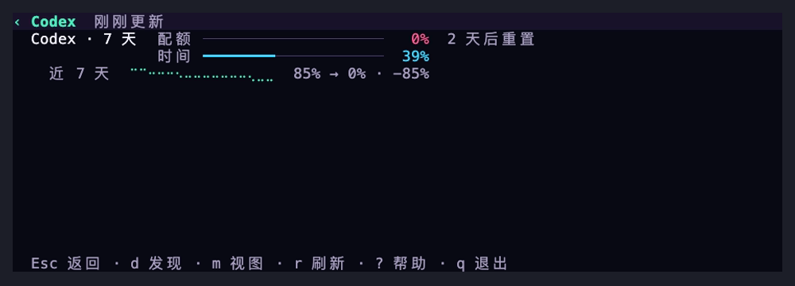
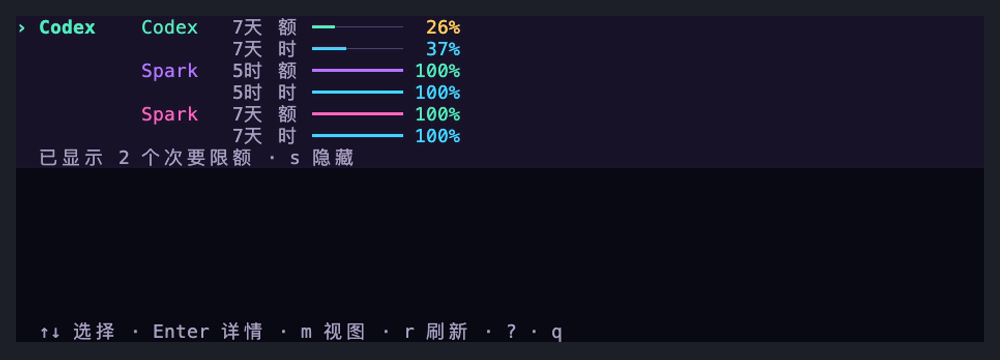
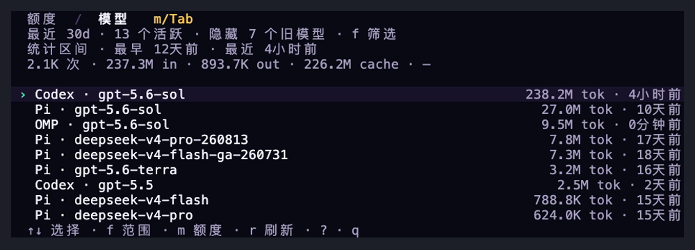
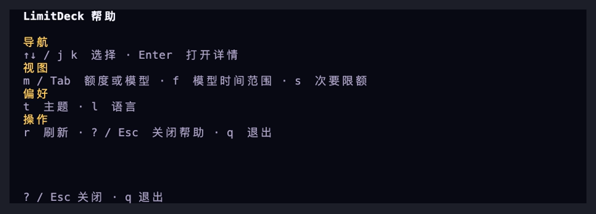

<div align="center">

# LimitDeck

**在额度撞线之前，先知道还剩多少。**

一个紧凑、隐私安全的 AI 编程订阅额度与本地模型用量终端仪表盘。

[](https://github.com/rockythink/limitdeck/releases/latest)
[](https://crates.io/crates/limitdeck)
[](https://github.com/rockythink/limitdeck/actions/workflows/ci.yml)
[](LICENSE)

[English](README.md) · [简体中文](README.zh-CN.md)

</div>

<p align="center">
  <code>brew install rockythink/tap/limitdeck</code>
</p>

<p align="center">
  
</p>
<p align="center"><sub>额度详情 → 通览 → 最近 30 天模型 → 全部历史 → 上下文帮助</sub></p>

---

## 一个界面，只看真正重要的额度信息

<table>
<tr>
<td width="33%" valign="top">
<strong>隐私是设计前提</strong><br><br>
只使用本地接口，只保存汇总后的额度和用量元数据。不复制凭据、不读取浏览器 Cookie、不抓取订阅网页，也不读取 Codex <code>auth.json</code>。
</td>
<td width="33%" valign="top">
<strong>只留下有效信号</strong><br><br>
在一个界面里查看剩余百分比、重置时间、各模型 Token 与成本和本地额度历史，不必来回打开多个应用或账户页面。
</td>
<td width="33%" valign="top">
<strong>为终端而生</strong><br><br>
全键盘操作、窄终端紧凑布局、三套运行时主题，并提供 macOS 与 Linux 预编译包。
</td>
</tr>
</table>

## 界面截图

<table>
<tr>
<td width="50%" valign="top">
<br>
<sub><strong>额度详情。</strong> 用同一尺度对照剩余额度、重置时间与本地历史。</sub>
</td>
<td width="50%" valign="top">
<br>
<sub><strong>额度通览。</strong> 在一个紧凑界面里查看所有有效重置窗口。</sub>
</td>
</tr>
<tr>
<td width="50%" valign="top">
<br>
<sub><strong>模型用量。</strong> 按 Agent 与完整模型 ID 汇总本机活动。</sub>
</td>
<td width="50%" valign="top">
<br>
<sub><strong>上下文帮助。</strong> 只展示当前界面可用的操作。</sub>
</td>
</tr>
</table>

## 安装

### Homebrew — macOS 推荐

```bash
brew install rockythink/tap/limitdeck
```

### Cargo

需要 Rust 1.88 或更高版本。

```bash
cargo install limitdeck
```

### 预编译包

从[最新 GitHub Release](https://github.com/rockythink/limitdeck/releases/latest)下载 macOS 或 Linux 压缩包以及 `SHA256SUMS`。

安装后，在任意终端启动：

```bash
limitdeck
```

LimitDeck 会自动发现已经安装并登录的 Codex CLI，不需要额外登录 LimitDeck。

## 数据来源

| 订阅 | 本地来源 | 支持状态 |
| --- | --- | :---: |
| Codex | 官方 Codex App Server，`account/rateLimits/read` | 内置 |
| Claude | 官方 Claude Code status-line JSON | 内置 |
| Codex 备用来源 | OMP 脱敏用量输出 | 可选 |

Codex App Server 与 OMP 备用来源同时可用时，LimitDeck 优先使用 App Server。

```text
官方本地协议 ─┐
纯额度快照 ───┼─> 标准化额度窗口 ─> LimitDeck
可选脱敏输出 ─┘
```

## 本地模型用量

按 <kbd>m</kbd> 或 <kbd>Tab</kbd> 可在订阅额度与模型用量之间切换。模型用量按实际发起请求的 Agent、提供方和完整模型 ID 分组。这些计数代表本机 Agent 活动，不是提供方账户全量，也不能换算成订阅额度百分比。

页签下方会显示当前选中模型的统计区间，即本机数据中最早和最近一次观测到该模型用量的时间。每个来源都会统计其本地记录中仍然保留的全部用量，因此即使某个 Agent 在当前选中模型的统计期间内没有使用，较旧记录仍可能显示。

模型用量默认显示最近 30 天。按 <kbd>f</kbd> 可在 **24 小时**、**7 天**、**30 天**和**全部**之间循环切换。状态行会显示活跃模型数量以及被隐藏的较旧模型数量。筛选只改变界面，不会删除任何本地记录。

| Agent | 数据来源 | 覆盖范围 |
| --- | --- | --- |
| OMP | `omp stats --json` | 请求、Token、缓存、错误、成本和性能 |
| Codex | 本地 rollout 记录中的纯元数据字段 | 请求和各类 Token；不含成本 |
| Claude Code | `limitdeck ingest claude` 收到的模型、上下文和成本字段 | 配置 status-line 后观察到的用量 |
| Gemini CLI | 本地会话记录中的纯元数据字段 | 请求和各类 Token；不含成本 |
| OpenCode | 从本地 SQLite 数据库查询用量列 | 请求、Token、缓存、错误和成本；需要 `sqlite3` |
| Pi | `~/.pi/agent/sessions` 中的纯元数据字段 | 请求、Token、缓存、错误、成本和时间 |
| Aider | Aider 可选的 analytics JSONL 日志 | 配置后记录请求、Token 和成本 |

Aider 需要启用本地 analytics 日志：

```yaml
# ~/.aider.conf.yml
analytics-log: ~/.cache/limitdeck/aider.jsonl
```

如使用其他路径，请设置 `AIDER_ANALYTICS_LOG`。LimitDeck 不读取 Aider 的 LLM 历史或聊天历史。

## Claude Code 配置

Claude Code 通过官方 status-line 输入提供订阅限额。将以下配置加入 `~/.claude/settings.json`：

```json
{
  "statusLine": {
    "type": "command",
    "command": "limitdeck ingest claude",
    "refreshInterval": 60
  }
}
```

该命令会在 `$XDG_CACHE_HOME/limitdeck` 中写入两个文件；未设置 `XDG_CACHE_HOME` 时使用 `~/.cache/limitdeck`：

- `claude.json` 保存额度窗口；
- `claude-models.json` 保存按模型汇总的用量。

只有符合条件的订阅才会收到 Claude Code 的 `rate_limits`，而且当前会话完成第一次 API 响应后才会出现。

> 这项配置会替换现有的 Claude Code 自定义状态栏。若你已经使用状态栏脚本，请在原脚本中调用 `limitdeck ingest claude`，并通过 stdin 传入原始 JSON。

## 界面

### 语言

LimitDeck 启动时会依次读取 `LC_ALL`、`LC_MESSAGES` 和 `LANG` 中第一个非空值。中文 locale 默认显示中文，其他 locale 默认显示英文。按 <kbd>l</kbd> 可在当前会话中立即切换语言。


### 配额与时间

每个重置窗口都在上下对齐的两行中，以同一条从 100 降至 0 的尺度展示两个剩余百分比：

- **额 / 配额** — 剩余额度。
- **时 / 时间** — 距离重置的剩余时间占完整窗口时长的比例。

通览与详情都将配额置于时间上方，两条进度条从同一位置起步，可以直接对照。LimitDeck 不判断使用情况，也不提供建议。

### 次要限额

GPT-5.3-Codex-Spark 窗口作为次要限额，默认隐藏。有可用窗口时，界面会用一行中性状态文字说明隐藏数量。按 <kbd>s</kbd> 可在通览与详情中显示或隐藏这些窗口。该选择仅在当前会话生效，不影响数据采集与本地历史。

### 主题

按 <kbd>t</kbd> 循环切换：

| 主题 | 风格 |
| --- | --- |
| **Rainbow** | 默认主题。深色背景搭配绿色、紫色、粉色、橙色和蓝色强调，灵感来自 OMP |
| **Midnight** | 克制、偏冷的深色主题 |
| **Mono** | 高对比黑白灰主题 |

主题会立即应用，并在下次启动 LimitDeck 时恢复。LimitDeck 遵循 [`NO_COLOR`](https://no-color.org/) 约定；如需显示主题颜色，请取消该环境变量。

### 快捷键

| 按键 | 操作 |
| --- | --- |
| <kbd>↑</kbd> / <kbd>↓</kbd>、<kbd>k</kbd> / <kbd>j</kbd> | 选择订阅 |
| <kbd>Enter</kbd> | 打开或关闭订阅详情 |
| <kbd>Esc</kbd> | 返回列表，再按一次退出 |
| <kbd>r</kbd> | 刷新数据来源 |
| <kbd>m</kbd> / <kbd>Tab</kbd> | 切换额度与模型用量 |
| <kbd>f</kbd> | 在 24 小时、7 天、30 天和全部模型用量之间切换 |
| <kbd>s</kbd> | 显示或隐藏次要限额 |
| <kbd>t</kbd> | 切换主题 |
| <kbd>l</kbd> | 切换中文与英文 |
| <kbd>?</kbd> | 打开或关闭当前界面的快捷键帮助 |
| <kbd>q</kbd> | 退出 |

进度条保留至少 8 列的可读宽度。多个窗口无法并排时，列表会在空间允许时（至少 32 列）将各窗口的配额/时间对比纵向排列，优先缩短名称而不是挤压进度条。宽度或高度仍不足时，改用上下对齐的百分比，不再显示过短的条形图。详情页会缩短长窗口名称并保留周期，低于 40 列时使用简短指标标签，重置说明也会先于条宽让出空间。

模型视图会跟随当前选择：宽度低于 64 列时显示聚焦指标卡片，64–95 列时将所选模型指标与自动滚动的摘要列表结合，更宽时显示完整表格。底部快捷键说明也会在截断前自动缩短。

主题、语言、模型时间范围和次要限额显示状态保存在 `$XDG_CONFIG_HOME/limitdeck/config.json`；未设置 `XDG_CONFIG_HOME` 时使用 `~/.config/limitdeck/config.json`。无效或不受支持的偏好文件会被忽略，并在下次修改偏好时由安全默认值替代。

### 本地额度历史

终端高度足够时，打开订阅详情即可查看本地采样历史。

- 当前周期存在至少三个变化样本时，显示紧凑的 Braille 趋势线。
- 趋势同时标明真实时间跨度、起始值、结束值和变化量。
- 历史持平或样本稀疏时继续使用文字，避免画出误导性图形。
- 额度上升时开始新的视觉周期。

历史保存在 `$XDG_CACHE_HOME/limitdeck/history.json`；未设置 `XDG_CACHE_HOME` 时使用 `~/.cache/limitdeck/history.json`。每个额度窗口最多保留 30 天、2,048 个样本。取得最初两个真实样本后，数值未变化时最多每 15 分钟采样一次。

## 隐私是设计前提

LimitDeck 只保留绘制仪表盘所必需的最小状态。

| 本地保留 | 明确忽略 |
| --- | --- |
| 提供方、订阅和额度窗口标识 | 账户邮箱与账户 ID |
| Agent、提供方、模型 ID 和汇总 Token | 提示词、回复、工具输出和推理内容 |
| 剩余百分比、重置时间和用量时间戳 | 组织与订阅等级 |
| Agent 本地报告的模型成本 | 提供方账单明细 |
| 历史时间戳、可用状态和界面偏好 | 原始凭据与提供方响应 |

解析器输入与子进程输出都有大小上限。子进程有明确超时，并会在退出时回收。

诊断信息只保留固定的数据来源标签和安全的失败类别。原始 stderr、提供方载荷、凭据、账户字段、邮箱地址和本地路径都不会保存在应用状态中。

## 数据来源无法刷新时

失败的数据来源不会从界面消失。存在旧快照时会标记为缓存；没有快照时则显示 `不可用 · Enter 查看原因`。

| 原因 | 下一步 |
| --- | --- |
| 未找到来源命令 | 安装对应 CLI，确认它位于 `PATH`，再按 <kbd>r</kbd> |
| 来源尚未登录 | 登录对应数据来源，再按 <kbd>r</kbd> |
| 来源响应超时 | 检查网络，再按 <kbd>r</kbd> 重试 |
| 提供方协议变化 | 升级 LimitDeck；问题仍存在时提交 Issue |
| Claude 快照缺失 | 将 `limitdeck ingest claude` 配置为 Claude Code 状态栏 |
| 缓存快照过期 | 刷新数据来源后再按 <kbd>r</kbd> |

## 架构

核心刻意保持简单：

```text
官方协议 / 安全快照 / 只取元数据的本地记录
                         │
          PlanAdapter + ModelUsageAdapter
                  │                  │
     CodingPlan → UsageWindow    ModelUsage
                  └─────────┬────────┘
                      应用状态 → TUI
```

适配器负责各提供方的解析和超时策略；领域层和 UI 不依赖 Codex、Claude 或 OMP 的响应格式。

## 开发

```bash
cargo fmt --check
cargo test --locked --all-targets --all-features
cargo clippy --locked --all-targets --all-features -- -D warnings
cargo build --release --locked
```

## 项目说明

LimitDeck 是独立开源项目，与 OpenAI、Anthropic 或 OMP 不存在隶属或背书关系。提供方接口与订阅限额可能变化。

本项目采用 [MIT License](LICENSE)。
